# SeQuenC-UseCases

## Setup: 

1. Run qunicorn, camunda and the workflow modeller using the provided docker-compose
2. The services should now be available under:
   1. qunicorn: localhost:5005/swagger-ui/
   2. workflowmodeller: localhost:8080/
   3. camunda: localhost:8078/camunda/app/

## Running the Use Cases

1. Have Qunicorn, Camunda and the Workflowmodeller running (possibly using the docker-compose).
2. Open the Workflowmodeller.
3. Configure the Workflowmodeller, so it uses the correct Camunda Endpoint.
4. Open the Use Case to be executed.
5. Deploy the Use Case.
6. Open Camunda, navigate to Camunda Tasklist.

   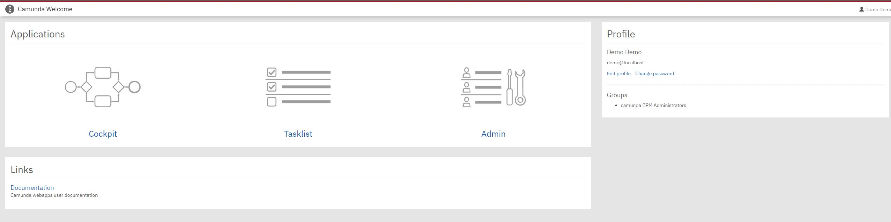
8. Click "Start process" on the top right.

   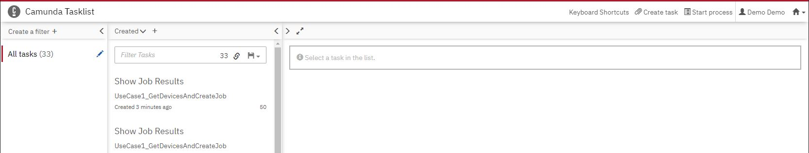
10. The Deployed Workflow should appear here.
11. Click on the Workflow and configure the Inputs if necessary.

   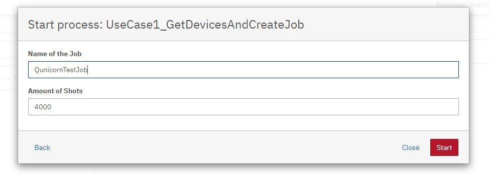
12. Start the process.
13. UserTasks will appear in the Tasklist.

   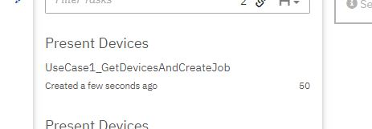
14. Click on the UserTask and evaluate it. 
   
   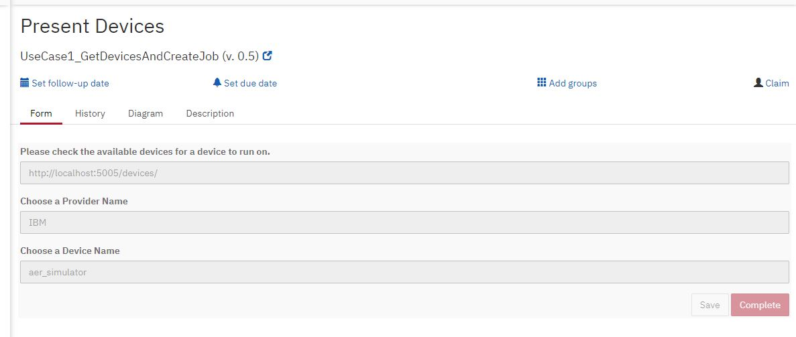

## Description of the Use Cases

### Get Devices and Create Job:
1. Get all devices
2. UserTask: Let the user evaluate the results, the user can now select a device
3. Create a job with the choosen device, and other user inputs
4. Get the results/details of the job
5. UserTask: Let the user evaluate the results

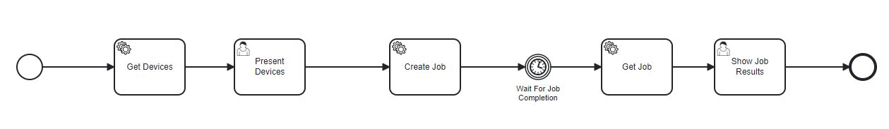

### Rerun Job: (Aer_simulator, QISKIT, IBM)
1. Rerun a job
2. Get the results/details of the job
3. UserTask: Let the user evaluate the resuls

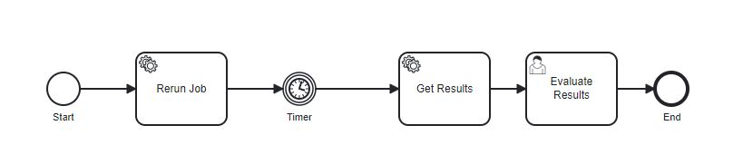

### Get a Provider List
1. Get all providers
2. UserTask: Let the user evaluate the results 

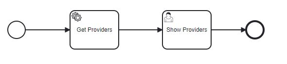

### Create and Delete a Deployment
1. Create a deployment
2. Get the deployment details, and get deployment X
3. UserTask: Evaluate Results of the deployment details
4. Delete the deployment
5. Get all deployment
6. UserTask: Evaluate results and check if the deployment X is missing again

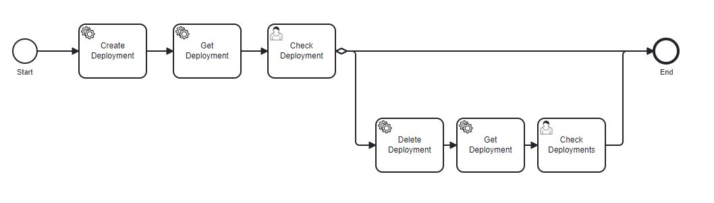

### Create, Run and Delete BRAKET Job on AWS
1. Create a job for AWS using Braket
2. Get the results/details of the job
3. UserTask: Let the user evaluate the results
4. Delete the job
5. Get all Jobs
6. UserTask: Let the user check if the job got deleted and is not in the list anymore

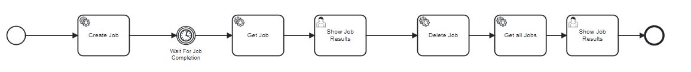

### Create, Run BRAKET Deployment on IBM
1. Create a job for IBM using Braket
2. Get the results/details of the job
3. UserTask: Let the user evaluate the results

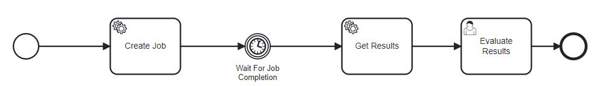

### Create QRISP Deployment and run on IBM
1. Create a deployment using QRISP
2. Create a job using the created deployment
3. Get the results/details of the job
4. UserTask: Let the user evaluate the results

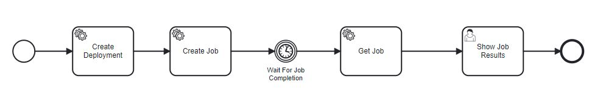

### Create Deployment with User Inputs and then a Job with UserInputs:
1. Create a deployment using defined User Inputs
2. Get the details of the deployment
3. UserTask: Let the User evaluate the deployment
4. Create a job
5. Get the results/details of the job
6. UserTask: Let the user evaluate the results

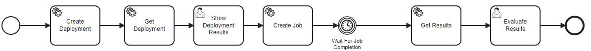

## Naming Scheme for new Use Cases

Use_Case_#NR_Description
